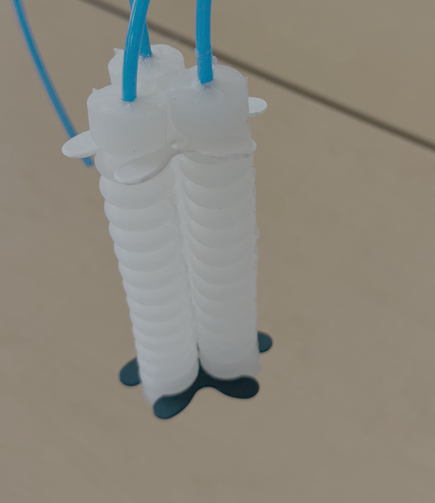
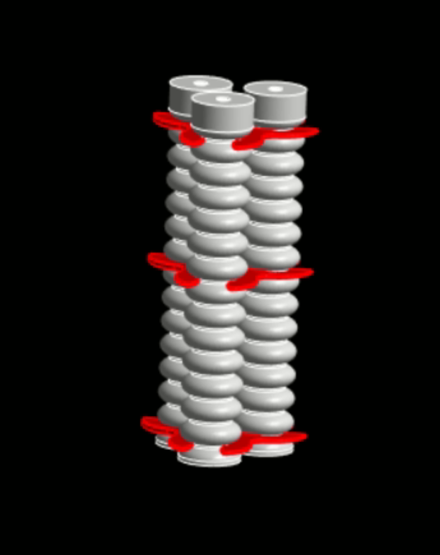

# An Action-Conditioned World Model for a Soft Robot: From CAD to Differentiable Simulation

This project implements an action-conditioned world model for a soft robotic manipulator. It demonstrates a complete end-to-end design pipeline: moving from a raw CAD file, to high-fidelity finite element simulation (ANSYS), and finally into a fast, differentiable neural simulator.

## Project Overview

* **The Robot:** A custom soft robotic manipulator designed with a combination of 3 inflatable bellows.
* **The Dataset:** Video data collected via ANSYS finite element simulations. The environment captures 4 distinct viewpoints (3 side views and 1 top view) across a pressure control range of 1 Pa to 100,000 Pa, incremented in 25,000 Pa steps, together with random walks.
* **The World Model:** A 2D neural simulator that autoregressively predicts the physical deformation and spatiotemporal dynamics of the soft robot conditioned directly on the pressure actions. 

| Real-Life Hardware | ANSYS Simulation Environment |
| :---: | :---: |
|  |  |

## Technical Architecture

To achieve stable, long-horizon physics predictions without collapsing, the model leverages several advanced training methodologies:
* **Autoregressive Dynamics Engine:** Utilizes a Convolutional GRU (ConvGRU) to model temporal physics and inertia across a 24-frame sequence.
* **Curriculum Learning & Scheduled Sampling:** Employs Teacher Forcing decay to gently transition the network from a single-step predictor to a fully unguided, blind autoregressive physics engine.
* **Multi-Objective Loss:** Balances visual fidelity and structural logic using a combination of BCE Loss, Dice Loss (for precise mask boundaries), and Inverse Action Loss.

## Neural Simulation Results

Below are samples of the 2D world model successfully predicting the physical bending dynamics of the soft robot over time. 

### Validation Set (Unseen Ground Truth Comparison)

| &nbsp; | &nbsp; |
| :---: | :---: |
| **Validation Case 1** <video src="https://github.com/user-attachments/assets/c1271794-bbf2-4f06-86bd-ed9205048f92" autoplay loop muted playsinline width="100%"></video> *Unseen Validation Target 1* | **Validation Case 2** <video src="https://github.com/user-attachments/assets/37669af7-841a-41a1-9778-121285f71a94" autoplay loop muted playsinline width="100%"></video> *Unseen Validation Target 2* |
| **Validation Case 3** <video src="https://github.com/user-attachments/assets/f29866b0-1955-4b43-979b-a13ecaa47461" autoplay loop muted playsinline width="100%"></video> *Unseen Validation Target 3* | **Validation Case 4** <video src="https://github.com/user-attachments/assets/b5e3e15c-48aa-4f7c-aed2-a6b9f53a9ee5" autoplay loop muted playsinline width="100%"></video> *Unseen Validation Target 4* |
| **Validation Case 5** <video src="https://github.com/user-attachments/assets/ce0c52d2-1f60-4804-b397-1b367bfbef7b" autoplay loop muted playsinline width="100%"></video> *Unseen Validation Target 5* | **Validation Case 6** <video src="https://github.com/user-attachments/assets/c776879d-8a44-4862-a397-9331a11b3949" autoplay loop muted playsinline width="100%"></video> *Unseen Validation Target 6* |

### Custom Action Sequences (Pure Generation)
*These sequences have no ground truth reference. The model is hallucinating the physics purely based on the input pressure actions.*

| &nbsp; | &nbsp; | &nbsp; |
| :---: | :---: | :---: |
| **Custom Sim 1** <video src="https://github.com/user-attachments/assets/a3e3e04d-79a6-4ebc-8050-7c9a23e1c209" autoplay loop muted playsinline width="100%"></video> *No Ground Truth Reference* | **Custom Sim 2** <video src="https://github.com/user-attachments/assets/ea8fab15-a49e-4677-8e87-88f186a31ec9" autoplay loop muted playsinline width="100%"></video> *No Ground Truth Reference* | **Custom Sim 3** <video src="https://github.com/user-attachments/assets/7f22e276-d2da-4df8-a454-059eb4303f72" autoplay loop muted playsinline width="100%"></video> *No Ground Truth Reference* |

## Notes

- Supports up to Python 3.12 since Open3D isn't supported by newer versions.
